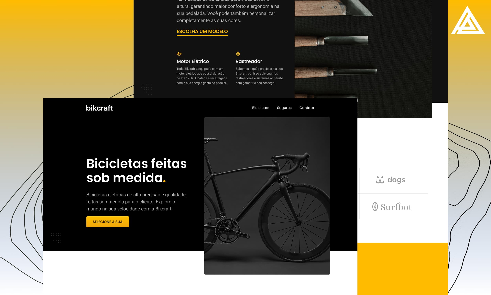

# Alex Holanda - Portfolio Pessoal Origamid

> Site de vendas e contração de seguros BIKCRAFT desenvolvido no curso da ORIGAMID.

    

[Visualizar Projeto](https://alexhollsp.github.io/bikcraft/)

## Design

O design do site de portfólio foi cuidadosamente elaborado no Figma, utilizando princípios de UI (User Interface) para criar uma experiência atraente e intuitiva. Cada seção foi planejada com o objetivo de destacar as bicicletas inovadoras e seus seguros.

## Desenvolvimento

A estrutura do site foi construída de forma lógica e semântica, garantindo não apenas a estética, mas também a acessibilidade e a otimização para os navegadores.

## Tecnologias Utilizadas

    
  
 

## Desenvolvedor

Desenvolvido Por:

<table>
  <tr>
    <td align="center">
      <a href="#">
         
        
          <b>Alex Holanda</b>
        
      </a>
    </td>
  </tr>
</table>
